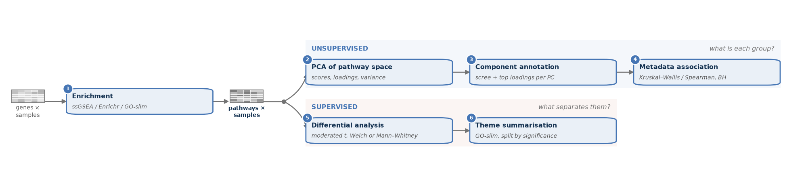

# PathwayTheme

Pathway-level analysis of any per-feature matrix, unsupervised and supervised
from one score matrix:

**enrichment → grouping → PCA → differential testing → figures and tables.**

Gene-level measurements become per-sample pathway scores once. The components
of that space are reported with the pathways that define them and tested
against every recorded sample variable, biological and technical alike. The
supervised half tests which pathways differ between groups and condenses
thousands of terms into tens of categories.

Available in Python (this page) and R ([`r/`](r/README.md)) as two native
implementations of the same pipeline: same YAML configs, same stages, same
output files, verified against each other numerically.

**Documentation** — the PCA mathematics: [docs/METHODS.md](docs/METHODS.md) ·
differential testing and category roll-up:
[docs/DIFFERENTIAL.md](docs/DIFFERENTIAL.md) · the R package:
[r/README.md](r/README.md) · a worked case study:
[manuscript/](manuscript/README.md).

## How it works



One enrichment pass produces the score matrix both halves read. The
unsupervised branch asks what each group is, the supervised branch asks what
separates them.

**Input** is a `features × samples` table (genes, proteins, anything
quantified) or single-cell `.h5ad` files summarised per cluster. **Grouping**
is by a metadata column, by existing cluster labels, or by automatic
clustering, and a scope column gives one independent PCA per sample. Samples
can be restricted at any point, and the whole score matrix can be written as a
QC heatmap.

The schematic is drawn by the package rather than by hand, so a paper's figure
and this page cannot drift apart:
`python -c "from pathwaytheme.viz import render_workflow; render_workflow('docs/assets/workflow.png', dpi=200)"`.

## Install

```bash
uv venv --python 3.12
uv pip install -e ".[all]"
```

`[all]` adds `.h5ad` input, GO-slim and improved plot labels. Plain
`uv pip install -e .` covers ssGSEA and EnrichR from a matrix.

## Usage

### One call

```bash
uv run pathwaytheme init -o my_config.yaml     # a template to edit
uv run pathwaytheme run my_config.yaml
```

```python
import pathwaytheme as pt

pt.run_pipeline("my_config.yaml")

pt.run_pipeline(**{                            # or without a file
    "input.matrix_path": "expr.tsv",
    "input.metadata_path": "meta.tsv",
    "enrichment.backend": "ssgsea",
    "enrichment.gmt_path": "go_bp.gmt",
    "grouping.target_col": "treatment",
    "output_dir": "results",
})
```

Complete configurations: [`examples/asps_gobp.yaml`](examples/asps_gobp.yaml)
(bulk matrix → GO:BP ssGSEA → PCA, differential and categories),
[`examples/moh_sm.yaml`](examples/moh_sm.yaml) (single-cell → one PCA per
sample), [`examples/matrix_enrichr.yaml`](examples/matrix_enrichr.yaml) (matrix
→ EnrichR).

### Stage by stage

Each stage is one function whose output feeds the next:

```python
import pathwaytheme as pt

data    = pt.load_matrix("expr.tsv", metadata="meta.tsv")   # or pt.load_h5ad("h5ad_folder/")
data    = pt.filter_samples(data, "tumor_type", ["ASPS"])   # optional
scores  = pt.enrich(data, backend="ssgsea", gmt="go_bp.gmt", geneset="GO_BP")
groups  = pt.group(scores, mode="target", target_col="treatment")
results = pt.pca(scores, groups)
pt.figures(results, "results", geneset="GO_BP")
```

Test which pathways differ between groups, then roll the hits up:

```python
d = pt.diff(scores, groups, method="moderated_t")           # welch | mannwhitney | moderated_t
d.significant(0.05)                                         # effect, p, FDR per pathway
summary = pt.summarize_categories(d, "gobp_categories.tsv",
                                  significance_col="fdr")   # significant vs not, per category

pt.sanity_heatmap(scores, "qc.pdf", label_col="treatment")
```

Switching backend or grouping mode is a one-line change:

```python
scores = pt.enrich(data, backend="enrichr", gmt="go_bp.gmt", top_n=200)
scores = pt.enrich(data, backend="goslim",  gmt="goslim.gmt")

groups = pt.group(scores, mode="auto", n_clusters=4)                        # no labels needed
groups = pt.group(scores, mode="target", target_col="cell_type",
                  scope_col="sample_id")                                    # one PCA per sample
```

### The numbers themselves

```python
r = pt.pca(scores, groups)[0]
r.scores               # each sample's position on each component
r.loadings             # each pathway's weight in each component
r.variance_explained   # the variance each component carries
r.signatures           # the pathways that define each group
```

### What each component is

Naming a component by its extreme pathways says what varies. It does not say
whether that variation is biological or technical. Enable the `metadata` block
and every component is tested against every annotated variable: Kruskal-Wallis
with η² for categorical variables, Spearman with ρ² for continuous ones, and
Benjamini-Hochberg correction across the whole grid.

```yaml
metadata:
  enabled: true
  columns: ["diagnosis", "sample_type", "library_type", "rin"]
  technical: ["library_type", "rin"]    # labelling only, so the two are separable by eye
  per_level: true                       # also test each level against the rest
```

An omnibus test says a component separates the levels of a variable, not which
level. `per_level` adds the one-versus-rest breakdown (Mann-Whitney with a
signed rank-biserial effect), which is what identifies a component as the axis
of one particular subtype.

## Outputs

Per PCA scope, under `results/<geneset>/sample_pca/<scope>/`:

- **figures** — scree, score heatmap, biplots, pairwise-component grid,
  per-group signatures, top pathways per component, loading heatmaps;
- **tables** — variance explained, top pathways per component, per-group
  signatures, component scores;
- **component attribution** *(with `metadata` enabled)* —
  `*_metadata_pc_association.tsv`, its matrix form, the per-level breakdown,
  and the attribution figures.

Per gene-set collection, under `results/<geneset>/`:

- **differential** *(when enabled)* — one table of every pathway per comparison
  (effect, p-value, FDR, direction), a volcano and a top-pathway figure per
  comparison, and a category summary when a term → category map is supplied;
- **coverage** — which requested gene sets were scored, and why the rest were
  not;
- **QC** *(when enabled)* — the pathway × sample sanity heatmap.

## Common options

| Where | Option | Meaning |
|---|---|---|
| `filter_samples` | `column`, `keep` | keep only samples whose metadata matches |
| `enrich` | `backend` | `ssgsea` · `enrichr` · `goslim` |
| `enrich` | `gmt` | path to a gene-set `.gmt` file |
| `enrich` | `top_n` / `threshold` | how EnrichR and GO-slim pick each sample's genes |
| `group` | `mode` | `target` · `existing` · `auto` |
| `group` | `target_col` | metadata column to compare and colour by |
| `group` | `scope_col` | run a separate PCA within each value of this column |
| `pca` | `size_col` | metadata column setting dot sizes (e.g. cell counts) |
| `metadata` | `columns`, `technical`, `per_level` | variables to test, how to label them, and the one-versus-rest breakdown |
| `diff` | `method` | `welch` · `mannwhitney` · `moderated_t` |
| `diff` | `reference` / `contrasts` | reference group, or explicit `[[case, ref], …]` (default: one-vs-rest) |
| `summarize_categories` | `mapping` | term → category map (dict, Series or `.tsv`) |
| `summarize_categories` | `significance_col` | split each category into significant and non-significant (e.g. `fdr`, `alpha=0.05`) |
| `sanity_heatmap` | `label_col` | metadata column for the heatmap colour strip |

## The same pipeline in R

```r
remotes::install_local("r")
library(pathwaytheme)

pt_run_pipeline("my_config.yaml")          # the same YAML this page uses

scores <- pt_enrich(pt_load_matrix("expr.tsv", metadata = "meta.tsv"),
                    backend = "ssgsea", gmt = "go_bp.gmt", geneset = "GO_BP")
groups <- pt_group(scores, mode = "target", target_col = "treatment")
pt_figures(pt_pca(scores, groups), "results", geneset = "GO_BP")
```

The R package is native rather than a wrapper around Python, and every stage is
verified against this implementation on shared inputs (38 checks, agreement to
~1e-13). The name mapping and the known differences are in
[r/README.md](r/README.md); reproduce the comparison with
`python r/parity/run_python.py && Rscript r/parity/compare.R`.

## Case study

[`manuscript/`](manuscript/README.md) reproduces a published application of the
package end to end: 901 transcriptomes, ten pipeline runs, and every figure,
table and quoted number, as six notebooks run in order from public input data.
